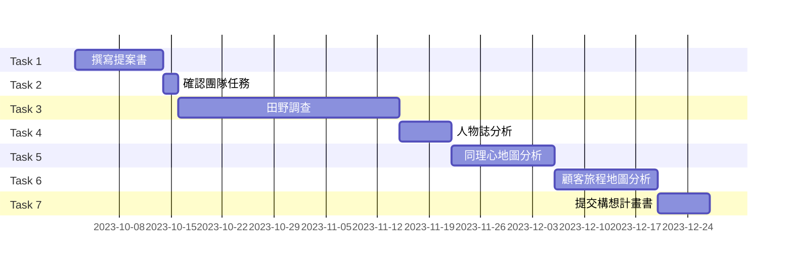

(1)甘特圖

```mermaid
gantt
    section Task 1
    撰寫提案書:a1, 2023-10-02, 12d
    section Task 2
    確認團隊任務:a2,after a1  , 2d
    section Task 3
    田野調查:a3,after a2  , 30d
    section Task 4
    人物誌分析:a4,after a3  , 7d 
    section Task 5
    同理心地圖分析:a5,after a4  , 14d
    section Task 6
    顧客旅程地圖分析:a6,after a5  , 14d
    section Task 7
    提交構想計畫書:a7,after a6  , 7d
    
```

(2)PERT/CPM 圖

(3)關鍵路徑

**關鍵路徑**:任務1->任務2->任務4->任務6->任務9->任務11
