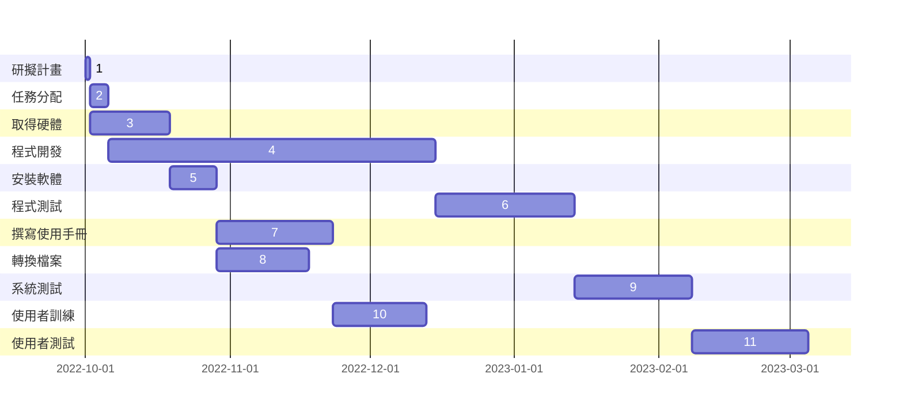

(1)PERT/CPM 圖

(2)甘特圖

```mermaid
gantt
    section 研擬計畫
    1:  a1, 2022-10-01, 1d
    section 任務分配
    2:  a2,after a1  , 4d
    section 取得硬體
    3:  a3,after a1  , 17d
    section 程式開發
    4:  a4,after a2  , 70d 
    section 安裝軟體
    5:  a5,after a3  , 10d
    section 程式測試
    6:  a6,after a4  , 30d
    section 撰寫使用手冊
    7:  a7,after a5  , 25d
    section 轉換檔案
    8:  a8,after a5  , 20d
    section 系統測試
    9:  a9,after a6  , 25d
    section 使用者訓練
    10:  a10,after a7, 20d
    section 使用者測試
    11:  a11,after a9, 25d
```

